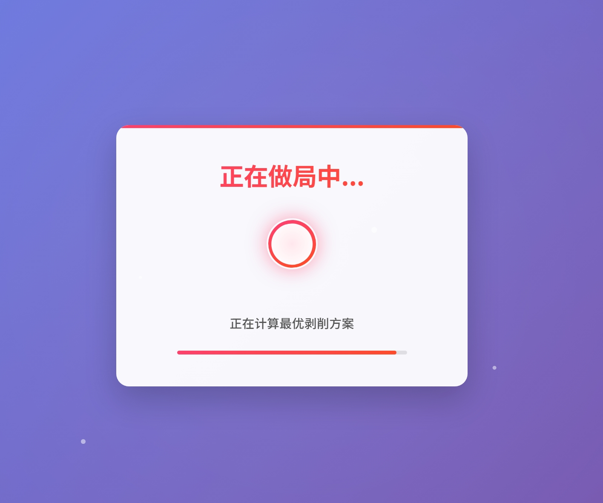

# 资本做局

一个有趣的网页，展示资本的"魔力"。

## 截图展示

### 开始界面


### 加载界面


### 结果界面


## 如何使用

1. 克隆仓库到本地
   ```
   git clone https://github.com/TYWIM/zbzj.git
   ```

2. 使用浏览器打开index.html文件

3. 点击"开始做局"按钮体验

## 在线体验

你可以通过以下链接在线体验：[资本做局](https://zj.0326.top/)

## 贡献

欢迎提交问题和改进建议！

## 许可

[MIT](LICENSE)